# Networking Workshop

Este proyecto convierte un servidor Java basado en sockets en una pequeña aplicación web secuencial. Sirve HTML, JavaScript e imágenes, expone algunos servicios codificados a mano, y termina corriendo en una instancia de AWS EC2.

---

## Parte 1: Introducción a la nomenclatura, redes, clientes y servicios con Java

| Ejercicio | Clases | Descripción | Cómo correrlo |
|---|---|---|---|
| 1 | ReadURL.java | Imprime los 8 componentes de un objeto URL | Run File |
| 3.2 | URLReader.java | Lee una página web línea por línea | Run File |
| 3.3 | *(incluido en URLReader/HeaderReader)* | Lee encabezados de respuesta HTTP | Run File |
| 2 | SavePageToFile.java | Pide una URL, descarga la página y la guarda en *result.html* | Run File, ingresa la URL cuando te la pida |
| 4.1/4.2 | EchoServer.java, EchoClient.java | Servidor y cliente de eco por sockets TCP | Server primero (Run File), luego Client |
| 4.3.1 | SquareServer.java, SquareClient.java | Servidor TCP en el puerto 36000 que recibe un número y devuelve su cuadrado | Server primero, luego Client |
| 4.3.2 | TrigServer.java, TrigClient.java | Servidor TCP en el puerto 37000 que aplica seno, coseno o tangente sobre un número, con estado (fun:sin, fun:cos, fun:tan) | Server primero, luego Client |
| 4.4/4.5.1 | HttpServer.java | Servidor web en el puerto 35000, acepta múltiples solicitudes consecutivas | Run File (Main Class del proyecto) |
| 5.2.1 | DatagramTimeServer.java, DatagramTimeClient.java | Servidor y cliente UDP en el puerto 4445; el cliente pide la hora cada 5 segundos y sigue funcionando aunque el servidor se caiga y reinicie | Server primero, luego Client |
| 6.4.1 | ChatApp.java, ChatService.java, ChatServiceImpl.java | Chat bidireccional usando RMI: cada instancia publica un objeto remoto y se conecta al de la otra persona | Corre ChatApp dos veces (dos instancias), cada una pide IP remota, puerto remoto, puerto local y nombre |

### Notas de ejecución

Cada servidor de sockets usa un puerto distinto (35000 para HttpServer, 36000 para SquareServer, 37000 para TrigServer, 4445 para DatagramTimeServer), así se pueden correr varios a la vez sin que choquen entre sí.

En NetBeans, para correr una clase que no sea la Main Class configurada del proyecto, siempre hay que hacer clic derecho sobre el archivo y elegir Run File, en vez del botón verde de la barra de herramientas, que solo ejecuta la Main Class.

---

## Parte 2: Desde un servidor HTTP mínimo hasta una aplicación web en AWS

### Qué hace la aplicación

Es una pequeña aplicación web escrita en Java puro, sin frameworks. El servidor está construido con sockets TCP (ServerSocket y Socket), lo que permite entender de cerca cómo funciona un servidor web por dentro, sin que una librería oculte los detalles.

La aplicación muestra una página HTML con imágenes y JavaScript, y además expone cuatro servicios dinámicos:

- *hello*, que recibe un nombre y devuelve un saludo personalizado en formato JSON.
- *square*, que recibe un número y devuelve su cuadrado.
- *time*, que muestra la hora actual del servidor.
- *health*, que permite comprobar que el servidor está funcionando correctamente.

La página usa JavaScript y fetch para comunicarse con estos servicios de forma asíncrona, así que los resultados aparecen sin tener que recargar toda la página.

La misma aplicación corre tanto en el computador local como en una instancia de AWS EC2, sin tocar el código: lo único que cambia es dónde se ejecuta.

### Qué problema aborda

La idea central es entender cómo funciona un servidor web desde sus conceptos más básicos, antes de meterse con temas más avanzados como la concurrencia o las arquitecturas distribuidas.

En vez de usar un framework que resuelva automáticamente buena parte de este trabajo, el proyecto deja ver cómo el servidor recibe una solicitud HTTP, interpreta la ruta pedida y decide qué respuesta enviar. También deja ver cómo se manejan distintos tipos de recursos: archivos de texto, imágenes, y respuestas generadas dinámicamente.

Otro punto que vale la pena observar es una de las limitaciones de un servidor tan básico: solo puede atender una conexión a la vez. Eso sirve como punto de partida para entender, más adelante, por qué hacen falta técnicas como los múltiples hilos, el balanceo de carga o el escalamiento.

### Cuál es el alcance del laboratorio

Este laboratorio es una primera aproximación al funcionamiento de un servidor web, así que su alcance es intencionalmente limitado. No incluye:

- Concurrencia ni múltiples hilos: el servidor atiende las conexiones una por una.
- Frameworks de enrutamiento, reflexión o anotaciones: las rutas están definidas directamente en el código.
- Balanceo de carga, autoescalado, contenedores o bases de datos.
- Autenticación, HTTPS, ni otros mecanismos de seguridad propios de un entorno de producción.

Lo que sí incluye es el manejo de recursos estáticos con el tipo de contenido correspondiente, servicios dinámicos con validación, comunicación asíncrona desde JavaScript, y pruebas tanto automáticas como manuales.

Por último, la aplicación se despliega en una instancia de AWS EC2 usando systemd para administrar el proceso del servidor. Esto permite comprobar que la misma aplicación desarrollada y probada localmente también puede correr en la nube sin modificar su código.

### Metáfora y arquitectura del sistema

#### La metáfora: una ventanilla única de trámites

Imagina una oficina de trámites con una sola ventanilla abierta y un solo funcionario atendiéndola. Cada persona que llega toma un turno, se acerca cuando la llaman, entrega su solicitud, espera a que el funcionario la resuelva por completo, y solo entonces se llama al siguiente número. Así se conecta esta metáfora con cada parte real del sistema:

| Elemento de la metáfora | Componente real del sistema |
|---|---|
| La persona que llega a hacer un trámite | El navegador, quien inicia el contacto pidiendo algo |
| La solicitud que entrega en el mostrador ("Vengo a pedir tal certificado") | La solicitud HTTP, una línea de texto que indica qué se quiere (GET /hello?name=Ana) |
| La cartelera con los formularios y trámites disponibles, que cualquiera puede consultar sin hacer fila especial | Los recursos estáticos (index.html, app.js, imágenes), siempre disponibles, sin lógica especial detrás |
| Los trámites express que el funcionario resuelve al instante, sin derivarlos a otra oficina | Los servicios codificados (hello, square, time, health), un conjunto fijo y reconocible de operaciones simples |
| El funcionario de la ventanilla, que solo puede atender a una persona a la vez | El servidor Java secuencial, un único hilo que completa una solicitud antes de llamar al siguiente turno |
| La persona que se sienta en la sala de espera con su número, en vez de quedarse parada pegada al mostrador | El cliente JavaScript asíncrono, la página sigue activa e interactiva mientras espera, sin congelarse |

La idea central es que, aunque la persona pueda sentarse tranquila a esperar su turno (el comportamiento asíncrono), la ventanilla sigue siendo una sola. Si dos personas llegan casi al mismo tiempo, una de ellas necesariamente espera a que la otra termine, sin importar qué tan cómoda esté esperando.

#### Diagrama de arquitectura

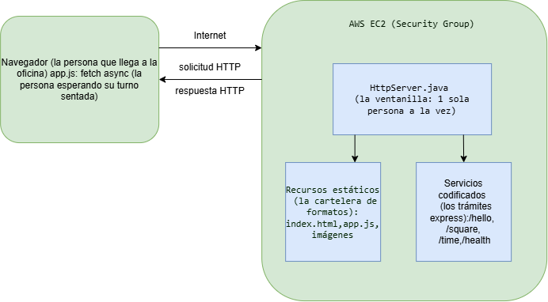

#### Responsabilidad de cada componente

El navegador es la persona que llega a la oficina: hace la primera solicitud (pide index.html) e interpreta lo que recibe, armando la página, ejecutando el JavaScript y mostrando las imágenes.

app.js hace de cliente JavaScript asíncrono, como la persona sentada esperando su turno: arma las URLs de los servicios, las pide con fetch, muestra "Cargando..." mientras espera, y actualiza solo el resultado o el error correspondiente cuando llega la respuesta.

El grupo de seguridad de EC2 funciona como el guardia de la entrada: controla quién puede entrar al edificio, dejando solo a los administradores por SSH y a cualquiera al puerto de la aplicación.

HttpServer.java es el funcionario de la ventanilla: recibe una solicitud, decide si es un trámite express (un servicio codificado) o algo de la cartelera (un recurso estático), y responde, todo antes de llamar al siguiente turno.

Los recursos estáticos son la cartelera de formatos: archivos que ya existen en src/main/resources/public, que el servidor solo lee y entrega con el tipo de contenido correcto.

Los servicios codificados son los trámites express: lógica mínima y fija por cada ruta (hello, square, time, health). El funcionario los resuelve de memoria, sin necesitar un manual general de procedimientos, es decir, sin un framework de enrutamiento.

### Decisiones de diseño

El servidor se mantiene secuencial a propósito, para poder observar primero el comportamiento de una sola conexión antes de resolver la concurrencia en una etapa posterior.

Las rutas están codificadas a mano en vez de usar un framework de enrutamiento, porque este último ocultaría el mecanismo real. Escribir cada ruta explícitamente deja visible cómo una URL selecciona un comportamiento específico.

El tipo de contenido de cada respuesta se selecciona según la extensión del archivo solicitado, con un valor genérico cuando la extensión no se reconoce.

Las rutas inseguras se rechazan normalizando la ruta antes de leer cualquier archivo, evitando así que alguien intente salir de la carpeta pública del proyecto.

El cliente del navegador es asíncrono porque el servidor, al ser secuencial, puede tardar en responder si hay otra solicitud en curso. Usar fetch junto con async y await evita que la página se bloquee mientras espera, manteniéndola interactiva hasta que la respuesta llega.

### Estructura del proyecto

```
networking-workshop/
├── pom.xml
├── src/
│   ├── main/
│   │   ├── java/co/edu/escuelaing/httpserver/
│   │   │   └── HttpServer.java          (servidor principal, Parte 2)
│   │   └── resources/public/
│   │       ├── index.html
│   │       ├── app.js
│   │       ├── costaAmalfitana.png
│   │       └── img1.jpg
│   └── test/
│       └── java/co/edu/escuelaing/httpserver/
│           └── HttpServerTest.java      (tests unitarios, JUnit 5)
└── target/httpserver.jar                (artefacto generado, no versionado)
```

El código de la aplicación vive en src/main/java, los recursos públicos (la página, el script y las imágenes) en src/main/resources/public, y las pruebas están separadas del código de la aplicación, en src/test/java.

### Requisitos previos

- Java 21
- Maven 3.8 o superior
- Opcionalmente, NetBeans, usado durante el desarrollo pero no necesario para compilar o correr el proyecto

### Instalación y compilación

```bash
git clone <URL-del-repositorio>
cd networking-workshop
mvn test
mvn package
```

El comando mvn test descarga las dependencias necesarias, incluyendo JUnit 5, y corre las pruebas automatizadas. El comando mvn package genera el artefacto desplegable en target/httpserver.jar.

### Cómo ejecutarlo localmente

```bash
java -jar target/httpserver.jar            # puerto 35000 por defecto
java -jar target/httpserver.jar 8080       # puerto personalizado
PORT=9000 java -jar target/httpserver.jar  # puerto por variable de entorno
```

Una vez arrancado, se abre http://localhost:35000/ (o el puerto que hayas elegido) en el navegador. Para apagarlo, basta con presionar Ctrl+C en la terminal donde está corriendo.

### Cómo usar la aplicación

La página principal ofrece tres acciones: escribir un nombre y presionar Saludar, escribir un número y presionar Calcular cuadrado, o presionar Consultar hora sin ningún dato adicional. Cada una llama a su servicio correspondiente:

| Acción | URL del servicio | Entrada esperada | Salida esperada |
|---|---|---|---|
| Saludar | GET /hello?name=... | Un nombre | Saludo en formato JSON con ese nombre |
| Cuadrado | GET /square?value=... | Un número | El número y su cuadrado en formato JSON |
| Hora | GET /time | Ninguna | La hora actual del servidor en formato JSON |

Si la entrada es inválida o falta un parámetro obligatorio, el servicio responde con un estado de error del cliente y un mensaje descriptivo, que aparece directamente en el área de Errores de la página, sin necesidad de recargarla.

### Cómo ejecutar las pruebas

Las pruebas automatizadas se ejecutan con:

```bash
mvn test
```

Cubren la lógica interna del servidor: el parseo de parámetros de consulta, el escape seguro de valores para JSON, y la selección del tipo de contenido según la extensión del archivo.

Las pruebas manuales se hicieron con el servidor corriendo, revisando uno por uno los casos de la matriz funcional: carga de la página, saludo y cuadrado válidos e inválidos, hora del servidor, archivo estático faltante, método no soportado, intento de acceso a rutas inseguras, y una serie de solicitudes consecutivas sin que el servidor se reinicie.

### Implementación en AWS

- Se empaquetó la aplicación como un jar ejecutable, con la clase principal indicada en el manifiesto.
- Se lanzó una instancia EC2 con Amazon Linux, usando el tipo de instancia más pequeño disponible.
- Se configuró un grupo de seguridad que solo permite conexiones SSH desde la IP del administrador, además del puerto de la aplicación.
- El artefacto se transfirió a la instancia mediante una copia segura por SSH.
- Se instaló el entorno de ejecución de Java necesario dentro de la instancia.
- Se configuró la aplicación como un servicio administrado por el sistema operativo, con reinicio automático ante fallos y registros escritos en archivos conocidos.
- El servicio se inició y se verificó su estado desde dentro de la instancia.
- Se confirmó su funcionamiento accediendo desde afuera con la dirección pública.
- Para detenerlo se usa el comando de control de servicios del sistema operativo, y el servicio se reinicia automáticamente cada vez que se transfiere una nueva versión del artefacto.

### Evidencia y resultados

#### Ejecución local

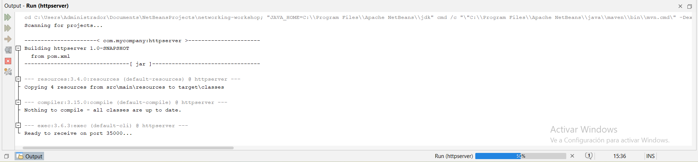
*El servidor arranca en el puerto 35000 por defecto cuando se ejecuta sin argumentos.*

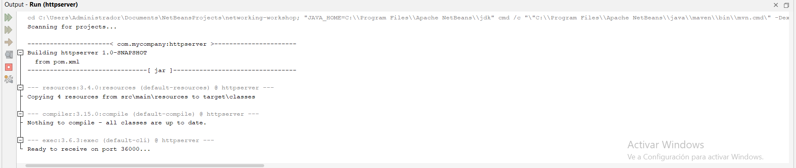
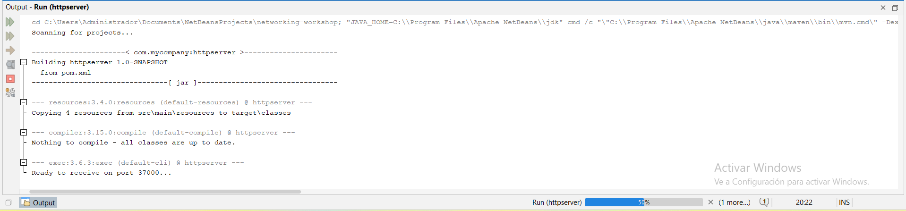
*El servidor toma un puerto distinto al pasarlo como argumento o variable de entorno, confirmando que es configurable.*

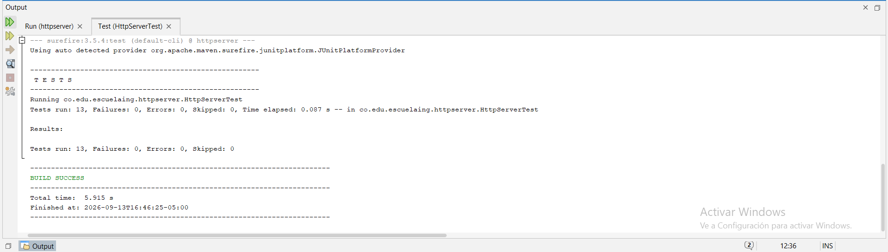
*Resultado de correr los tests automatizados con mvn test, todos exitosos.*

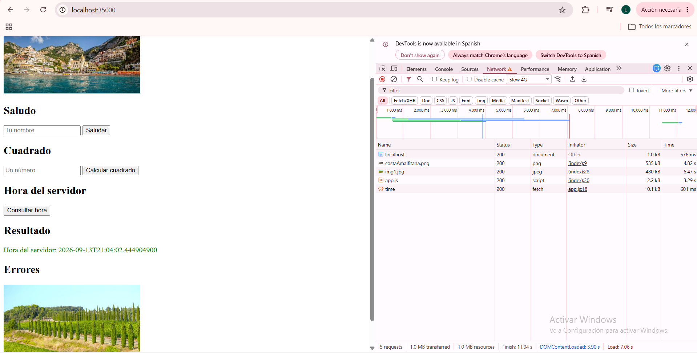
*La pestaña Network del navegador, corriendo el servidor localmente, muestra solicitudes independientes para la página, el script, cada imagen y un servicio dinámico, cada una con su código de estado y su tipo correcto.*

#### Ejecución remota (AWS EC2)

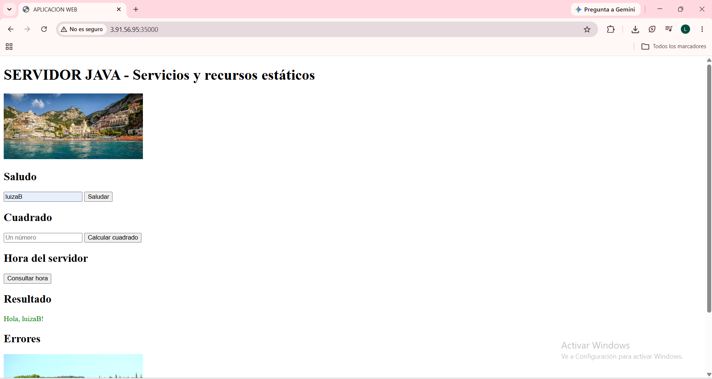
*La aplicación, ya desplegada en la instancia EC2, carga correctamente el HTML, el script y las imágenes desde la dirección pública de la instancia, y muestra la respuesta del servicio de saludo funcionando.*

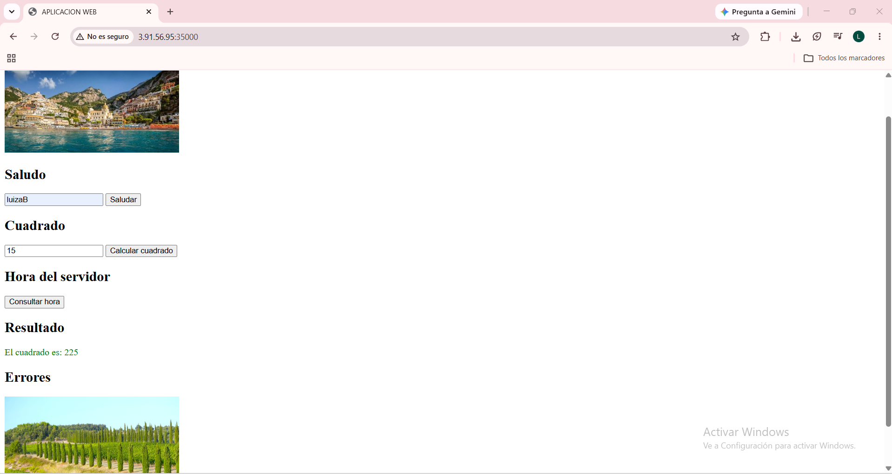
*Respuesta del servicio de cuadrado, obtenida desde la instancia remota.*

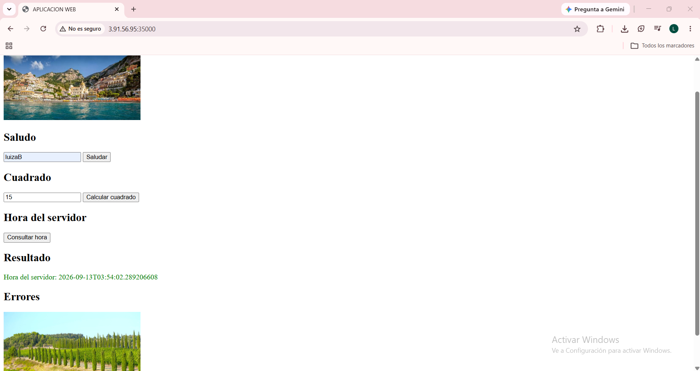
*Respuesta del servicio de hora, confirmando que el valor proviene del servidor remoto.*

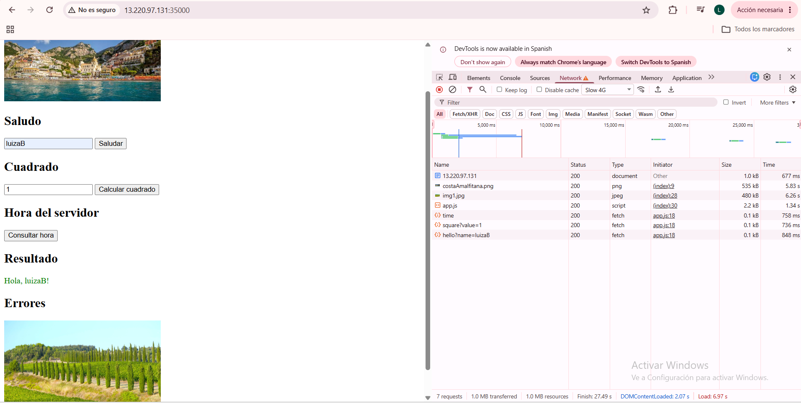
*La pestaña Network del navegador, contra la instancia EC2, muestra solicitudes independientes para la página, el script, cada imagen y un servicio dinámico, cada una con su código de estado y su tipo correcto.*

#### Solicitudes asíncronas

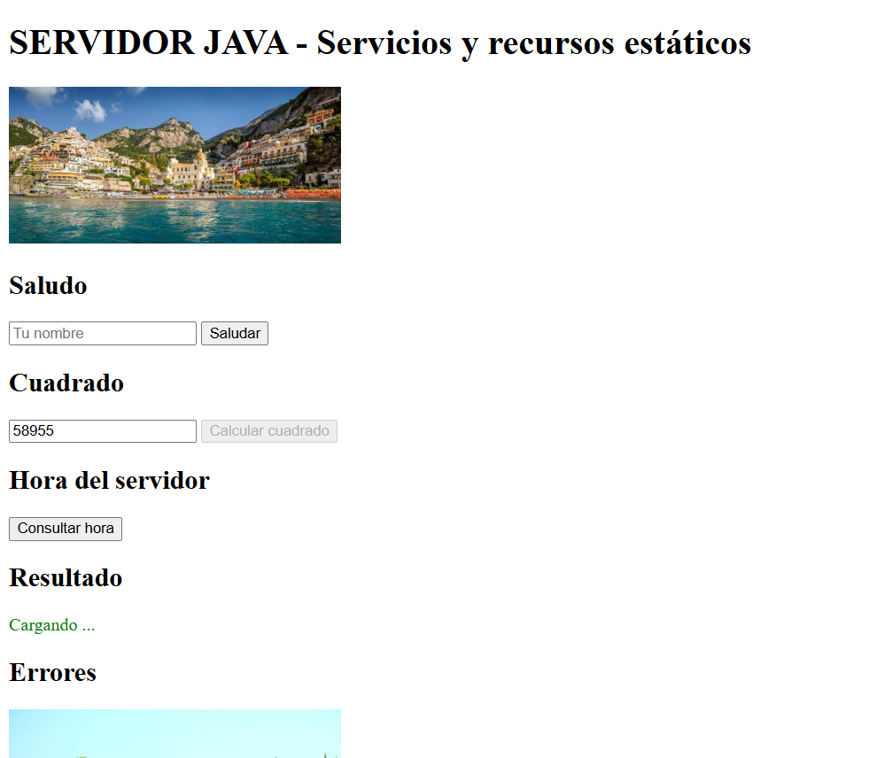
*Mientras la solicitud está en curso, se muestra el estado "Cargando..." y el botón correspondiente queda deshabilitado, sin bloquear el resto de la página.*

#### Errores controlados

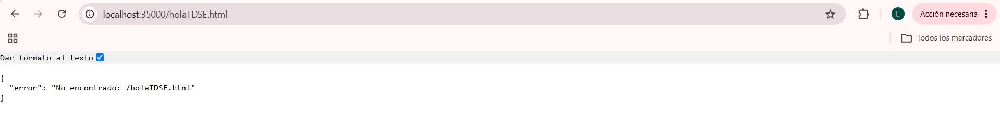
*Solicitud a un recurso que no existe, respondida con un error controlado en vez de una excepción cruda.*

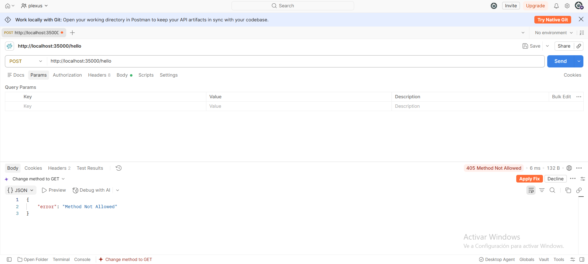
*Solicitud con un método distinto a GET, rechazada con el estado correspondiente.*

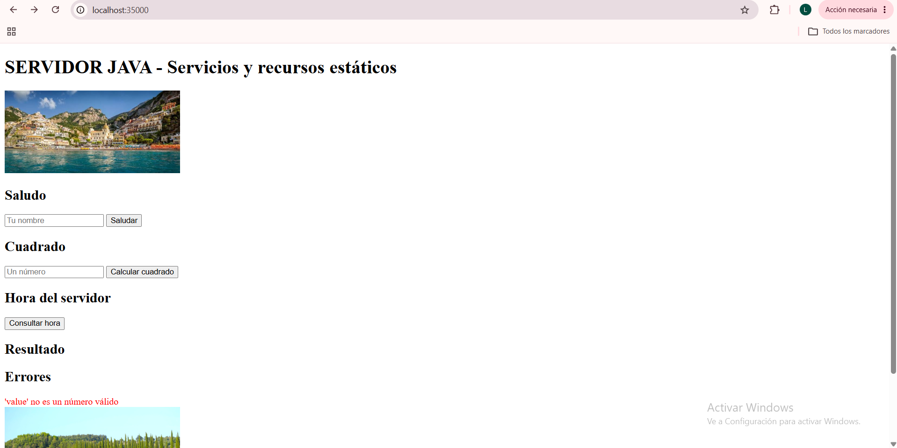
*Entrada no numérica en el servicio de cuadrado, respondida con un mensaje de error descriptivo.*

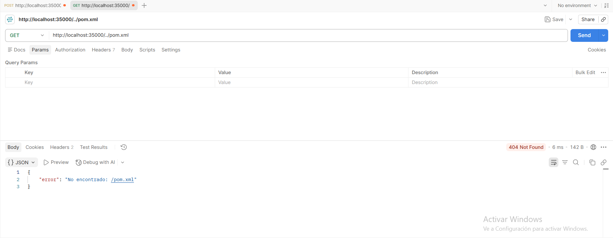
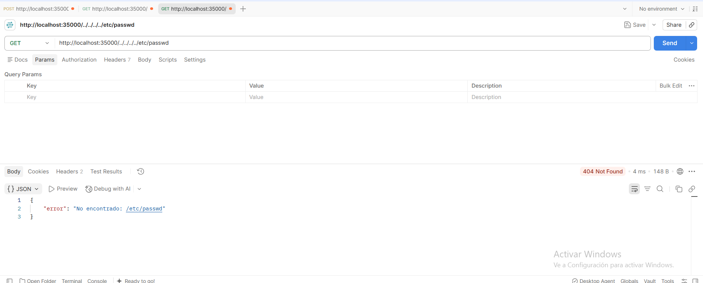
*Intentos de acceder a archivos fuera de la carpeta pública, sin que se exponga ningún archivo externo.*

#### Limitación secuencial

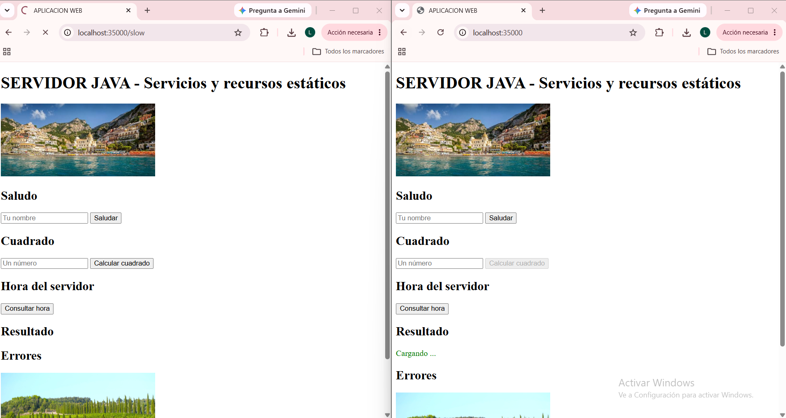
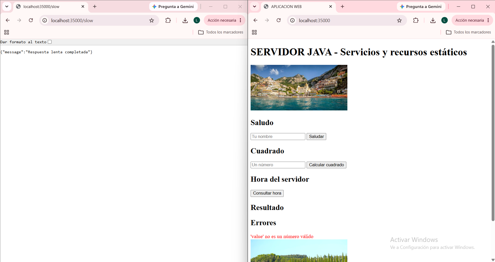
*Una solicitud lenta en una ventana bloquea la respuesta de una segunda solicitud en otra ventana, hasta que la primera termina, evidenciando que el servidor es secuencial.*

#### Solicitudes repetidas

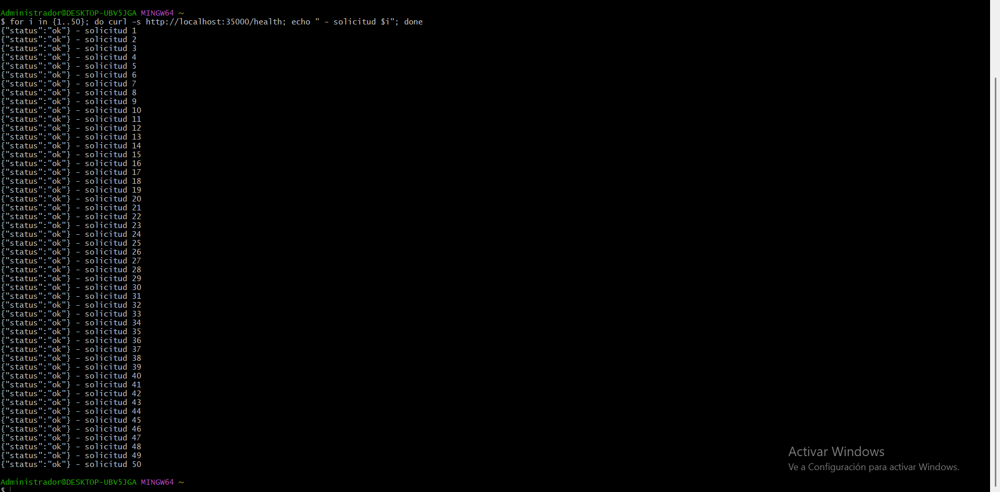
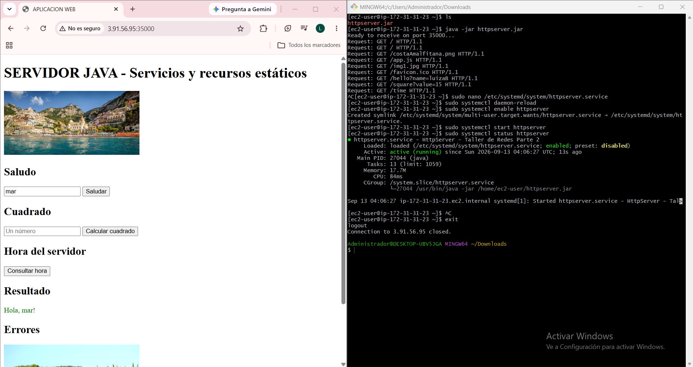
*Múltiples solicitudes consecutivas atendidas exitosamente por la misma ejecución del servidor, sin reinicios ni fallos.*

### Limitaciones conocidas

El servidor funciona de manera secuencial, así que solo puede atender una conexión a la vez y no usa hilos ni mecanismos de concurrencia. Por ahora solo admite el método GET; cualquier otro método es rechazado.

Las rutas y servicios están definidos directamente en el código, así que agregar un nuevo servicio requiere modificar el código fuente. Este servidor está pensado con fines académicos y de aprendizaje, no para un entorno de producción: no cuenta con HTTPS ni autenticación, y no está diseñado para atender varias solicitudes al mismo tiempo.

### Autor y agradecimiento

Autor: Luiza Gonzalez. Parte del enfoque y la estructura de este laboratorio se basa en la guía "Laboratorio de Redes · Parte 2" de la Escuela Colombiana de Ingeniería, y en los tutoriales de redes de Java disponibles en la documentación oficial de Oracle.